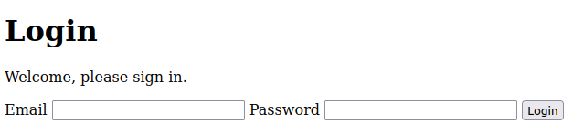
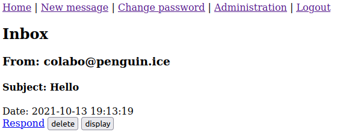
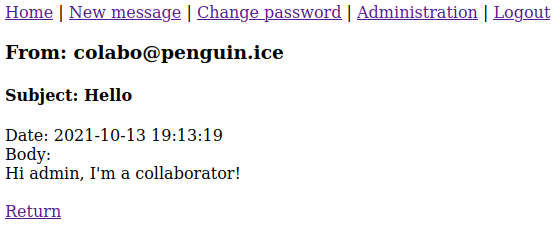
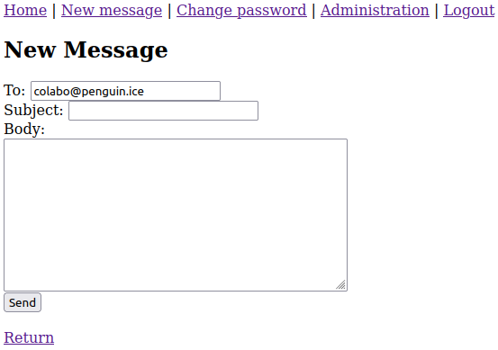
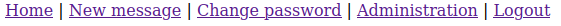
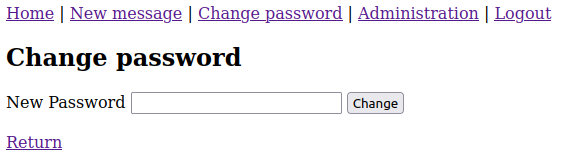
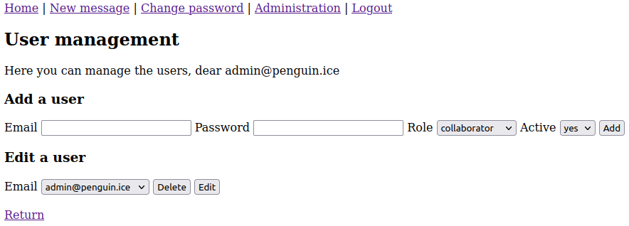
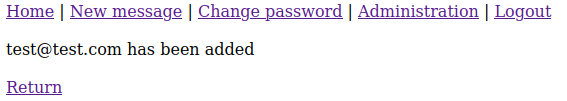
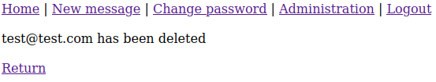
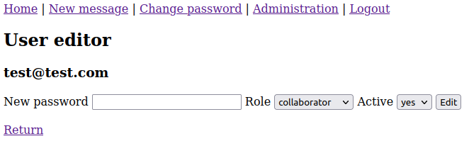

# STI project 2 | Penguin messenger
Gamboni Fiona, Do Vale Lopes Miguel 

16.01.2021


## Setup

### Create container

Use the command provided in the lab directory to create the container. Your working directory should be the cloned git repository, where you can see the folder `site`.

```bash
docker run -ti -v "$PWD/site":/usr/share/nginx/ -d -p 8080:80 --name sti_project --hostname sti arubinst/sti:project2018
```

A container named `sti_project` should have been created.


### Start container

After you created the container, you can run the script `run-container.sh` in the folder `docker` to start the container.

You can now access the login page by going to http://localhost:8080/ in your browser.


### Check permissions

Before going any further with the website. Please check that your directory `database` and the file `database.sqlite` can be written. If not, change the permissions to allow it.

In Linux:

```bash
chmod o+w site/database site/database/database.sqlite
```


## Manual

### Login

This is the first page, you will see when accessing the website:



We provided you two accounts to play with:

| email              | password | role         |
| :----------------- | -------- | ------------ |
| admin@penguin.ice  | 1234     | admin        |
| colabo@penguin.ice | 4321     | collaborator |


### Home page

Once you logged in successfully, you will see the home page with the inbox of the account. You can also click on `Home` in the navigation bar to access it:




Each message is listed by date (the newest at the top). You can see the author of the message, the subject and the date when it was sent. You have 3 direct interactions with the message:

- **delete** - Click on `delete`. Your message should no longer be visible.

- **display** - Click on `display` to see the content (body) of the message:

  

- **respond** - Click on `Respond` to respond to author of the message. Click on `send`, when your done:




### New message

To send a new message, simply click on `New message` in the navigation bar :



The form is the same as a direct response, you can then fill it and click on `Send` to send the message. 


### Change password

Click on `Change password` in the navigation bar to change your password:



Click then on `Change` to validate the modification. 


### Administration

This option is only visible in the navigation bar for the administrators. Click on it to access the user management:



#### Add

The first form is to add a new user. Click on `Add` to validate. A message as below should be displayed:



#### Delete

You can choose a user by his email and then click on `Delete` to delete. A message as below should be displayed:



#### Edit

As before, choose the user by his email and then click on `Edit` to edit him. You can then edit his password, role and activeness in by completing the form below and clicking on `Edit`: 



**Note:** don't fill the password if you don't want to change it


### Logout

Simply click on `Logout` in the navigation bar to logout. This will redirect you back to the login page.

